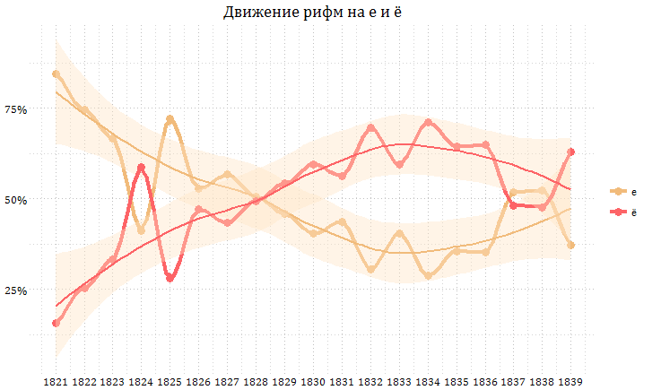

## Е и ё в русской рифме

В поэтическом корпусе НКРЯ во всех словах, написание которых допускает _ё_, использована буква _е_. Это связано с тем, что тексты для корпуса были взяты из изданий серии &laquo;Библиотека поэта&raquo;, в которых изначально отсутствовала буква _ё_. Кроме того, имеет место произношение [е] на месте [о] в заимствованных словах из церковнославянского, что отражает исторические особенности поэтической традиции, например, _звездной_ &nbsp; &mdash; &nbsp; _бездны_. Такое произношение уходит из привычной поэтической речи в инструментарий нарочитой архаизации в первой трети XIX века. Реальный процесс перехода к новому поэтическому языку происходил примерно в 1820-х годах.

Для автоматического распознавания рифм было важно определиться с точной датой перехода от одного типа рифм к другим, так как для поздних рифм мы использовали автоматическую проверку слов, в которых присутствует гласный _е_ по словарю слов с _ё_ (Чумаков 2009).
Чтобы определить точный год смены парадигмы, мы выгрузили все рифмы с буквой _е_ в позиции ударения в период с 1820-го по 1840-й год. Всего таких рифменных пар было 49 840. Далее все такие рифменные пары мы разметили вручную, отмечая:

- Использована ли буква _е_ на месте современной _ё_, то есть образована ли рифма ударным гласным [е] (_изображенным_ &mdash; _блаженным_);
- Произносится ли в обоих случаях [о] на месте буквы _е_, то есть образована ли рифма ударным гласным [о] (_найдет_ &mdash; _лед_).

По умолчанию, мы считали, что глагольные формы на _-ет_, в которых произносится [о] (_печет_, _кладет_), не могли произноситься с гласным [е], равно как и местоимения _ее_, _нее_ и тому подобные.
По результатам разметки мы сформировали таблицу, где для каждого года выписали два значения &mdash; процент рифм с ударным гласным [е], процент рифм с ударным гласным [о]. По полученным значениям мы построили график.

Рисунок 1. Движение рифм на е и ё

На Рисунке 1 точки пересечения линий приходятся на несколько периодов, однако логично предположить, что истинной точкой перехода является 1828-й год. Остальные выбросы можно считать случайными за счет некоторого несбалансированного фактора (например, из-за превалирования стихотворений некого автора в определенном году). Случайность выбросов также доказывается сглаженными линиями на графике, построенными по усредненным значениям.
Таким образом, 1828-й год был выбран точкой изменения в работе программы. После 1828-го года происходит проверка слов с буквой _е_ под знаком ударения в словаре слов с _ё_. Для достижения наибольшей точности можно было бы использовать ручную разметку, например, с привлечением краудсорсинга. Однако в настоящем исследовании мы ставили цель достичь наибольшей полноты, а не точности анализа, а кроме того, исходные данные корпуса были переданы нам конфиденциально. По этим причинам мы отказались от ручной разметки и считали, что для наших задач достаточно только автоматической разметки.
